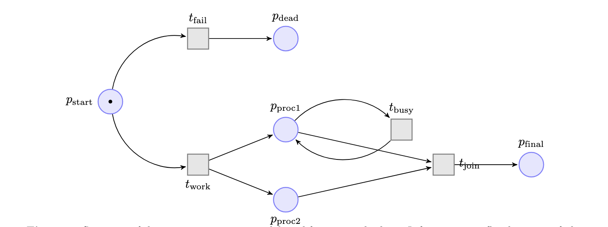
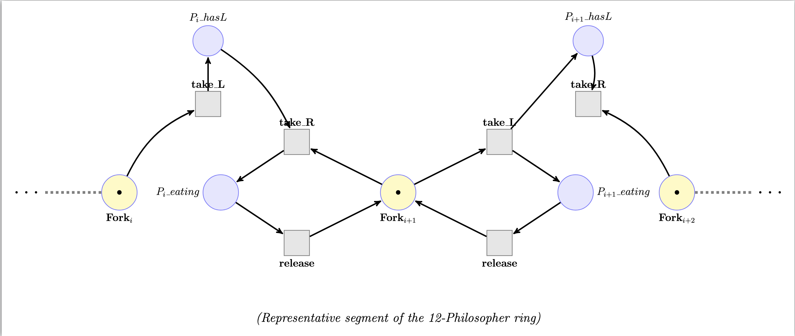

# Symbolic and Algebraic Reasoning in Petri Nets (CO2011 Assignment)

This repository contains the implementation of a **1-safe Petri Net Analyzer** developed for the Mathematical Modeling course (CO2011).  
The toolchain is organized into six tasks that together support parsing, reachability analysis, deadlock detection, and optimization.

At a high level, the analyzer combines three complementary techniques:

1. **Explicit State Enumeration (BFS)** – for baseline validation and small state spaces.
2. **Symbolic Reachability (BDDs)** – for scalable state-space exploration.
3. **Hybrid Reasoning (BDD + ILP)** – for deadlock detection and algebraic optimization.

These techniques are exposed through the following tasks:

- **Task 1 – PNML Parsing & Net Construction**  
  Parses PNML models (`.pnml`) into an internal `PetriNet` representation.  
  Handles places, transitions, arcs, and initial markings for **1-safe** Petri nets and is the common frontend used by all other tasks.

- **Task 2 – Explicit Reachability (BFS)**  
  Performs classic explicit-state enumeration from the initial marking using breadth-first search.  
  Produces the reachable state set and basic statistics (state count, time, memory) used as a baseline and for cross-checking the symbolic methods.

- **Task 3 – Symbolic Reachability (BDDs)**  
Encodes markings as Boolean vectors and transitions as BDD relations to compute the reachable set symbolically.  
Supports multiple image computation modes:
  - **relation**: a monolithic transition relation \(T(X,X')\);
  - **topological**: per–transition relations \(R_t(X,X')\);
  - **hybrid**: combines both for experimentation.  
The mode is selected via the `--image_mode` flag in `Task6_cli.py`.

- **Task 4 – Deadlock Analysis (Hybrid BDD + ILP)**  
  Uses the BDD-computed reachable set to symbolically filter **dead markings** (no enabled transitions),  
  then applies an Integer Linear Programming (ILP) state-equation check to confirm that candidate deadlocks are truly reachable.

- **Task 5 – Linear Optimization over Reachable Markings**  
  Optimizes a user-defined **linear objective** over the reachable state space.  
  Depending on the size of the state space, it either:
  - enumerates all markings (for small nets), or  
  - switches to **BDD-guided sampling** (adaptive optimization) for large nets such as `switches_15`.

- **Task 6 – Command-line Interface & Experiment Harness**  
  Provides a unified CLI to run Tasks 1–5 on PNML inputs, select objectives and modes, and reproduce the experiments reported in the assignment report.

## 📂 Project Structure

The project is organized as follows:

```text
PETRIANALYZER/
├── cases/                      # Test PNML models
│   ├── functional_test.pnml    # Synthetic net for correctness verification
│   ├── philosophers_12.pnml    # Dining Philosophers (N=12) for scalability test
│   └── switches_15.pnml        # 15 Toggle Switches for adaptive optimization test
├── logs/                       # Output logs from experiments (auto-generated)
├── src/                        # Source code
│   ├── model.py                # PetriNet data structure & 1-safe semantics
│   ├── utils.py                # Performance profiling (Time & Memory)
│   ├── Task1_pnml_parser.py    # XML Parser for PNML files
│   ├── Task2_explicit.py       # Explicit Reachability (BFS)
│   ├── Task3_bdd_reach.py      # Symbolic Reachability (BDD)
│   ├── Task4_deadlock.py       # Hybrid Deadlock Detection (BDD + ILP)
│   ├── Task5_optimize.py       # Optimization (Enumeration & Sampling)
│   └── Task6_cli.py            # Main CLI entry point
├── run_tests.py                # Unit test runner
├── requirements.txt            # Python dependencies
└── README.md                   # Project documentation
```

## 🛠️ Installation & Setup

### Prerequisites
* **Python 3.8+**
* **Virtual Environment** (Recommended)

### Setup Steps
Run the following commands in your terminal to set up the environment:

```bash
# 1. Create a virtual environment
python3 -m venv .venv
#Or
python -m venv .venv
#Or
py -m venv .venv

# 2. Activate the environment
# On macOS/Linux:
source .venv/bin/activate
# On Windows:
# .venv\Scripts\activate

# 3. Install dependencies (dd, pulp, lxml)
pip install -r requirements.txt

# 4. Create logs directory
mkdir -p logs
```

---
## 🧩 Benchmark Suite

To evaluate the tool's correctness and scalability, we employ three distinct PNML models. Below are the representative visualizations of these networks.

### 1. Functional Verification (`functional_test`)
A synthetic model designed to verify all logic components: Parser, Concurrency (Fork/Join), Self-loop updates, and Deadlock detection.

<p align="center">
  
  <br>
  <em>Figure 1: A compact net featuring non-determinism, concurrency, and a trap state.</em>
</p>

### 2. Scalability Benchmark (`philosophers_12`)
**Dining Philosophers ($N=12$)**: A classic high-concurrency model with cyclic resource dependencies.
* **Purpose:** Benchmarking BDD vs. Explicit performance (Memory/Time) and detecting circular deadlocks.
* **Visualization:** The diagram below represents a segment of the ring ($P_i$ and $P_{i+1}$ competing for $Fork_{i+1}$).

<p align="center">
  
  <br>
  <em>Figure 2: Representative segment of the 12-Philosopher ring showing resource competition.</em>
</p>

### 3. Optimization Benchmark (`switches_15`)
**Independent Switches ($N=15$)**: A model causing state-space explosion ($2^{15}$ states) with simple structure.
* **Purpose:** Triggering the **Adaptive Optimization** mechanism (switching from Enumeration to Sampling).
* **Visualization:** The diagram shows independent switch modules.

<p align="center">
  
  <br>
  <em>Figure 3: Independent toggle switch modules generating a combinatorial state space.</em>
</p>

---
## 🚀 Reproducing Experimental Results

We provide specific commands to reproduce the results reported in the **Experimental Evaluation** section of the report.

### 1. Functional Verification
* **Model:** `functional_test.pnml`  
* **Goal:** Verify correctness of Parser, Reachability, Deadlock (finding the trap state), and Optimization (avoiding the trap).

* **Command:**
```bash
python src/Task6_cli.py --pnml cases/functional_test.pnml \
  --objective custom --weights 0,0,0,0,10 \
  --confirm_ilp --image_mode relation \
  --seed 42 | tee logs/functional_test.log
```

**Explanation:**
* `--objective custom --weights 0,0,0,0,10`: assigns a high reward to the `p_final` place and zero to other places, forcing the optimizer to prefer the successful completion marking.
* `--confirm_ilp`: enables the hybrid BDD+ILP deadlock checker to prove that the reported deadlock is reachable using the state equation.
* `--image_mode relation`: runs Task 3 with the monolithic transition relation ($T(X,X')$), which is the baseline algorithm described in the report. Changing this to `topological` or `hybrid` lets you experiment with the alternative image computation schemes.
  * `Note`: To switch to the Topological method (Method 2 in the report), change this flag to `--image_mode topological`.

* `--seed 42`: makes any randomized components reproducible across runs.
### 2. Performance Benchmark (Explicit vs. BDD)
* **Model:** `philosophers_12.pnml` (State space: ~39,202)
* **Goal:** Demonstrate the "Variable Ordering" phenomenon where BDD consumes significantly more memory than Explicit BFS due to dependency distance.

* **Command:**
```bash
# Use -u (unbuffered) to ensure logs are written immediately during long runs
python -u src/Task6_cli.py --pnml cases/philosophers_12.pnml \
  --objective uniform \
  --confirm_ilp --image_mode relation \
  --seed 42 | tee logs/philosophers_12.log
```

**Explanation:**
* `python -u`: runs Python in unbuffered mode so that progress logs (especially BDD iterations) are flushed to the terminal immediately during long executions.
* `--objective uniform`: assigns equal weight to all places; this benchmark focuses on reachability and performance rather than a specific “business” goal.
* `--confirm_ilp`: is kept on because this model contains a real circular deadlock; ILP is used to validate the deadlock witness returned by the BDD analysis.
* `--image_mode relation`: uses the monolithic BDD relation so that the performance comparison with Explicit BFS matches the main algorithm in the report.
To additionally study the new topological method, you can rerun the same command with `--image_mode topological` and compare the time/memory overhead.

### 3. Adaptive Optimization (Sampling Mode)
* **Model:** `switches_15.pnml` (State space: 32,768)
* **Goal:** Trigger the adaptive mechanism. Since the state space > 5000 (threshold), the tool will switch from `enumerate` to `sample_bdd` to find the optimum efficiently.

* **Command:**
```bash
python src/Task6_cli.py --pnml cases/switches_15.pnml \
  --objective uniform \
  --enumeration_threshold 5000 \
  --sample_limit 1000 \
  --image_mode relation \
  --seed 42 | tee logs/switches_15.log
```

**Explanation:**
* `--objective uniform`: again uses equal weights; the purpose of this benchmark is to stress the optimization engine on a large, deadlock-free state space.
* `--enumeration_threshold 5000`: forces the optimizer to switch from full enumeration to BDD-based sampling once the reachable set is larger than 5000 states (here it is $2^{15} = 32,768$).
* `--sample_limit 1000`: bounds the number of BDD-guided samples explored, providing a good trade-off between runtime and solution quality for this model.
* `--image_mode relation`: keeps the BDD reachability phase in the monolithic mode for consistency with the other experiments. As before, `topological` and `hybrid` can be used to explore the alternative image computation strategies; the optimization logic itself is independent of the chosen mode.
     * `Note`: To switch to the Topological method (Method 2 in the report), change this flag to `--image_mode topological`.

---

## 📊 Expected Output
After running the commands, check the `logs/` folder. The exact numeric values for time and memory depend on your hardware, OS, and Python environment, and may vary slightly between runs (especially for BDD sampling). However, the overall qualitative behaviour should remain the same.

Below we summarize the typical outcomes you should observe. You can paste the concrete numbers from your own log files into this section if desired.

### 1. `functional_test.pnml`
From `logs/functional_test.log`, you should see for both Explicit and BDD:
* **Reachable markings:** 4 states (the two branches, the trap, and the final state).
* **Deadlock analysis:**
    * *Deadlock:* found with a reachable dead marking (e.g., `p_final`, while `p_dead` is also a trap in the model).
    * *ILP confirmation:* enabled by `--confirm_ilp` proves that the deadlock marking satisfies the state equation.
* **Optimization:**
    * *Optimization:* found with **Value ≈ 10** at a marking where `p_final` is marked (according to the custom weight vector 0,0,0,0,10).
    * This benchmark mainly validates that all components of the tool—parsing, explicit reachability, BDD reachability, deadlock detection, and optimization—are logically consistent.

### 2. `philosophers_12.pnml`
From `logs/philosophers_12.log`, the interesting points are:
* **Reachability:**
    * Explicit BFS and BDD both report `|Reach| ≈ 39,202` markings.
* **Performance comparison:**
    * *Explicit BFS:* runs relatively fast (on the order of a few seconds and tens of MB of memory).
    * *BDD reachability:* is much more expensive (hundreds of seconds and GB-level memory usage), illustrating the variable ordering and dependency effects discussed in the report.
* **Deadlock analysis:**
    * *Deadlock:* found with a circular-wait marking where all philosophers hold their left fork and wait for the right one.
    * *ILP confirmation:* (due to `--confirm_ilp`) verifies that this circular deadlock is reachable.

> **Note:** Exact timings and memory peaks in your environment may differ from those reported in the paper, but the relative ordering **Explicit time ≪ BDD time** and **Explicit memory ≪ BDD memory** should hold.

### 3. `switches_15.pnml`
From `logs/switches_15.log`, you should observe:
* **Reachability:**
    * Explicit BFS and BDD agree on `|Reach| = 32,768 = 2^{15}` markings.
* **Deadlock analysis:**
    * *Deadlock:* not found (the model is deadlock-free because any switch can always be toggled).
* **Optimization:**
    * The method reported should be **Optimization method: sample_bdd** (or similar), confirming that the adaptive optimizer switched to BDD-based sampling due to the large state space.
    * The best objective value is typically **≈ 15** under the uniform weighting scheme (one token per switch); depending on the sampling path, the particular optimal marking reported may vary but should always achieve this value.

> **Note:** Because sampling is randomized and the system environment is noisy, running the same command multiple times may yield slightly different runtimes, memory peaks, or even different (but still optimal or near-optimal) markings for the optimization task. The qualitative patterns above are what should match the Experimental Evaluation section.

## 📈 Our Experimental Results

This section presents the actual execution logs generated by our tool in our local environment. These results confirm the consistency between the theoretical design and the actual implementation.

### 1. Functional Verification (`functional_test`)
**Objective:** Verify that the tool correctly parses the Petri Net, identifies the trap state (deadlock), and finds the optimal path to the final state.

**Execution Log:**
```text
=====================================================================================
 RESULTS SUMMARY | Model: cases/functional_test.pnml
=====================================================================================
Task  | Component            | Result                         | Time (s)   | Mem (MB)  
-------------------------------------------------------------------------------------
1     | PNML Parsing         | |P|=5, |T|=4                   | 0.0006     | -         
2     | Explicit Reach       | Count=4                        | 0.0026     | 0.00      
3     | BDD (topo)           | Count=4 (iters=2)              | 0.0056     | 0.09      
4     | Deadlock Check       | FOUND @ ['p_final']            | 0.0589     | 0.15      
5     | Optimization         | Max=10                         | 0.0011     | 0.00      
=====================================================================================
```

### 2. `philosophers_12.pnml`
```text
=====================================================================================
 RESULTS SUMMARY | Model: cases/philosophers_12.pnml
=====================================================================================
Task  | Component            | Result                         | Time (s)   | Mem (MB)  
-------------------------------------------------------------------------------------
1     | PNML Parsing         | |P|=36, |T|=36                 | 0.0030     | -         
2     | Explicit Reach       | Count=39202                    | 1.5114     | 29.20     
3     | BDD (topo)           | Count=39202 (iters=12)         | 380.0044   | 2963.94   
4     | Deadlock Check       | FOUND @ ['p0_has_left', '...   | 3.9305     | 4.90      
5     | Optimization         | Max=12                         | 2.3052     | 42.88     
=====================================================================================
```

### 3. `switches_15.pnml`
```text
=====================================================================================
 RESULTS SUMMARY | Model: cases/switches_15.pnml
=====================================================================================
Task  | Component            | Result                         | Time (s)   | Mem (MB)  
-------------------------------------------------------------------------------------
1     | PNML Parsing         | |P|=30, |T|=30                 | 0.0015     | -         
2     | Explicit Reach       | Count=32768                    | 1.9310     | 24.76     
3     | BDD (topo)           | Count=32768 (iters=15)         | 39.0896    | 357.13    
4     | Deadlock Check       | None                           | 0.4656     | 0.00      
5     | Optimization         | Max=15                         | 0.8695     | 13.34     
=====================================================================================
```

## 👥 Authors (Group 2H3D)
* Nguyễn Trần Hoàng Hiếu (2452332)
* Nguyễn Kiên Đức (2452278)
* Phan Minh Hưng (2452427)
* Trần Chí Đại (2452237)
* Mai Xuân Đức (2452275)
